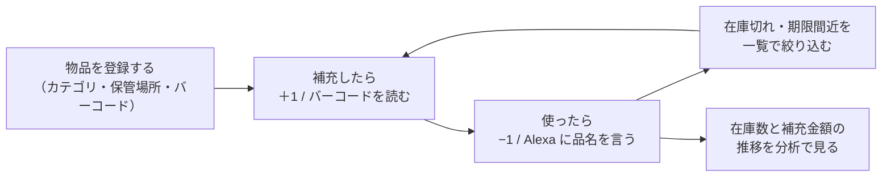

# ストクル — Stock＋Cycle（docker_inventory_management）

> **使ったら減らす、足したら増やす。在庫の出入りを、1回の操作で。**

社内の備品・消耗品を、**Web・スマートフォン・音声（Alexa）**のどこからでも1個単位で増減できる在庫管理アプリ。バーコードを読めば在庫が増え、「アレクサ、〇〇を払い出して」で減る。補充した金額と期限も記録され、在庫数と補充金額の推移をグラフで確かめられる。

> **ストクル** は本システムの呼称（旧称：在庫管理システム）。画面上のアプリ名と Alexa スキルの呼び出し名は「ストクル」。リポジトリ名・パッケージ名・Docker サービス名などの識別子は変更していない。

## コンセプト

備品の在庫表は、棚から取った人が記録を忘れると、すぐに実際の数とずれる。ずれた在庫表は信用されず、結局は棚を見に行くことになる。

ストクルは、**記録の手間を「1回の操作」まで減らす**ことで、在庫表を実物に近い状態に保つ。

| 考え方 | 内容 |
|---|---|
| 増減は、1回の操作で | 一覧の `＋` / `−`、バーコードの読み取り、Alexa への一言のどれでも、1個単位で在庫を増減できる |
| 手が空いていなくても | 両手がふさがっていても、Alexa に品名を言うだけで払い出せる |
| 補充のときだけ、少し詳しく | 在庫切れから補充するときだけ、単価と期限を記録する（任意）。ふだんの増減は即時に反映する |
| 誰が動かしたかを残す | 増減のたびに、日時と操作したユーザーを履歴に残す |
| 数字で振り返る | 在庫数と補充金額の推移を、日毎・月毎、全体・カテゴリ別のグラフで確かめる |

| 項目 | 内容 |
|---|---|
| ステータス | **主要機能は実装済み**（Web・モバイル・Alexa）。認可ロール・自動テストは未実装（[開発ロードマップ](#8-開発ロードマップ)） |
| 作成者 | **Makoto Kamimura** — [@makoto-kamimura](https://github.com/makoto-kamimura) |

このREADMEは、プロジェクト紹介と仕様書を兼ね、次の2部と付録で構成する。運用手順などの補足資料は [docs/](docs/) に置く。

| 部 | 内容 | 主な読者 |
|---|---|---|
| [第1部 概要説明](#第1部-概要説明) | 目的、用語、機能と画面の仕様、Alexa スキル、ロードマップ | すべての人 |
| [第2部 技術説明](#第2部-技術説明) | 技術スタック、システム構成、クイックスタート、実装方針、データモデル、API、非機能要件、本番構成 | 開発者 |
| [付録](#付録) | 決定事項、未決事項 | すべての人 |

## 目次

- [コンセプト](#コンセプト)
- [第1部 概要説明](#第1部-概要説明)
  - [特徴](#特徴) / [使い方のイメージ](#使い方のイメージ)
  - [1. 概要](#1-概要) / [2. 用語](#2-用語) / [3. ユーザー種別と権限](#3-ユーザー種別と権限) / [4. 基本フロー](#4-基本フロー) / [5. 画面一覧](#5-画面一覧)
  - [6. 機能要件](#6-機能要件) / [7. Alexa スキル](#7-alexa-スキル) / [8. 開発ロードマップ](#8-開発ロードマップ)
- [第2部 技術説明](#第2部-技術説明)
  - [9. 技術スタックとシステム構成](#9-技術スタックとシステム構成)（[クイックスタート](#96-クイックスタート)を含む）
  - [10. 認証の実装](#10-認証の実装) / [11. 機能ごとの実装方針](#11-機能ごとの実装方針) / [12. データモデル](#12-データモデル) / [13. API](#13-api)
  - [14. 非機能要件](#14-非機能要件) / [15. 本番デプロイ構成](#15-本番デプロイ構成)
- [付録](#付録)
  - [16. 決定事項](#16-決定事項) / [17. 未決事項](#17-未決事項)
- [ドキュメント](#ドキュメント) / [License](#license)

---

# 第1部 概要説明

サービスの目的・機能・画面の仕様をまとめる。技術的な内容は[第2部](#第2部-技術説明)に分ける。

## 特徴

Web とモバイルは同じ機能を持つ（画面構成のみ各プラットフォーム向けに最適化）。

| 特徴 | 内容 |
|---|---|
| 在庫一覧 | 在庫の +1 / −1、フィルタ（すべて / 在庫切れ / 期限 1ヶ月以内）、カテゴリ別 / 保管場所別の表示切り替え |
| 品目の編集 | 名前・バーコード・カテゴリ・グループ・保管場所の変更、削除、増減履歴の表示 |
| 在庫切れからの補充 | 在庫 0 からの +1 時に単価と期限を記録（任意） |
| バーコードスキャン | 起動直後のスキャン画面から読み取る。登録済みなら入庫（+1）/ 払い出し（−1）を選び、未登録なら物品追加へ（バーコードを引き継ぐ）。Web はキーボード入力 / USB バーコードリーダー、モバイルはカメラで読み取る |
| 物品追加 | 初期在庫・単価・期限・グループ・保管場所を指定して登録 |
| マスタ管理 | カテゴリ / グループ / 保管場所の追加・削除 |
| 分析 | 在庫数・補充金額の推移（日毎 / 月毎、総合計 / カテゴリ別） |
| Alexa で払い出し | 「アレクサ、ストクルを開いて」→「〇〇」で在庫を 1 個払い出す |
| テナント分離 | データはテナント単位で分離され、ユーザーは自分のテナントの品目だけを扱う |

## 使い方のイメージ



## 1. 概要

### 1.1 ポジショニング

社内（小規模なオフィス・家庭）向けの簡易在庫管理。発注・仕入先・ロット管理のような業務システムの機能は持たず、**「いま何個あるか」と「いつ・誰が・いくらで増減したか」**を正確に残すことに絞る。

### 1.2 原則

- 在庫の増減は 1 個単位の操作を基本にし、増減のたびに履歴を残す。
- 補充金額と期限は、在庫切れからの補充と物品追加のときだけ尋ねる（任意入力）。
- Web とモバイルは同じ機能・同じ表示ロジックを持つ（[11.4節](#114-web-とモバイルの共通ロジック)）。
- データはテナント単位で分離する。

## 2. 用語

| 用語 | 意味 |
|---|---|
| 品目（物品・Item） | 在庫を数える単位。名前・バーコード・カテゴリ・グループ・保管場所・在庫数を持つ |
| カテゴリ | 品目の分類（必須）。一覧の「カテゴリ別」表示と分析の「カテゴリ別」集計の単位 |
| グループ | カテゴリとは別に、品目を任意にまとめる単位（任意） |
| 保管場所 | 品目を置いている場所の自由記述（任意）。一覧の「保管場所別」表示の単位 |
| 履歴 | 在庫の増減 1 回ごとの記録。増減数・日時・操作したユーザー・補充金額・期限を持つ |
| 補充金額 | 在庫 0 からの補充時、または物品追加時に記録する金額（円・任意） |
| 期限 | 補充した物品の使用期限・賞味期限（任意）。一覧では、履歴に記録された最も早い期限を使って「期限 1ヶ月以内」を絞り込む |
| 払い出し | 在庫を 1 個減らす操作（−1） |
| テナント | データを分離する単位。ユーザー・品目・マスタはいずれか 1 つのテナントに属する（`demo` / `main`） |

## 3. ユーザー種別と権限

| 種別 | 内容 |
|---|---|
| ユーザー | メールアドレスとパスワードでログインする。所属テナントの品目・マスタ・履歴をすべて操作できる |
| Alexa スキル | 環境変数 `API_TOKEN` のトークンを持つユーザーとして API を呼ぶ。操作対象はそのユーザーのテナントの品目 |

- ユーザーはシーダー（または artisan）で作成する。画面からの新規登録・ユーザー管理はない（[docs/runbooks/operation.md §3.5](docs/runbooks/operation.md)）。
- 認可ロール（管理者 / 一般などの権限差）はない（[Q1](#17-未決事項)）。
- デモアカウント（`admin@example.com` / `user@example.com`、パスワード `password`）は `demo` テナントに属し、demo のサンプルデータだけが見える。パスワードは公開前提の値なので、実運用のユーザーには使わない。

## 4. 基本フロー

| # | フロー | 内容 |
|---|---|---|
| 4.1 | ログイン | メールアドレスとパスワードでログインする。`demo` テナントのユーザーには、ヘッダーに「デモ環境（サンプルデータ）」を表示する |
| 4.2 | 物品を追加する | 名前・カテゴリ・初期在庫（必須）と、バーコード・グループ・保管場所・単価・期限（任意）を入力する。初期在庫が 1 以上なら履歴に記録する |
| 4.3 | 増やす・減らす | 一覧の `＋` / `−` で 1 個ずつ増減する。在庫 0 での `−` はできない |
| 4.4 | 在庫切れから補充する | 在庫 0 の品目を `＋` したとき（バーコード経由を含む）だけ、単価と期限の入力モーダルを出す。どちらも省略できる |
| 4.5 | バーコードを読む | 登録済みなら在庫 +1（在庫 0 なら 4.4 のモーダル）。未登録なら、読んだバーコードを引き継いで物品追加へ進む |
| 4.6 | 絞り込む・並べ替える | 「すべて / 在庫切れ / 期限 1ヶ月以内」で絞り込み、「カテゴリ別 / 保管場所別」で表示を切り替える |
| 4.7 | 分析する | 在庫数（水準）または補充金額（合計）を、日毎 / 月毎・総合計 / カテゴリ別の折れ線で見る |
| 4.8 | Alexa で払い出す | 「アレクサ、ストクルを開いて」→ 品名を言うと 1 個払い出し、残数を答える（[第7章](#7-alexa-スキル)） |

## 5. 画面一覧

### 5.1 Web（Next.js）

| ログイン | 在庫一覧 |
| --- | --- |
|  |  |

| 画面 | 内容 |
|---|---|
| ログイン | メールアドレス・パスワード。ログイン状態は保持する |
| スキャン | ログイン後の初期画面。スキャンボタンからバーコードを入力し、登録済みなら入庫 / 払い出しを選ぶ |
| 在庫一覧 | フィルタ・表示切り替え（セクションは初期状態で折りたたみ）・`＋` / `−`・品目の編集（名前・バーコード・カテゴリ・グループ・保管場所・削除）・履歴モーダル |
| 物品追加 | 4.2 の入力項目 |
| マスタ管理 | カテゴリ / グループ / 保管場所のタブ。追加と削除 |
| 分析 | 在庫数 / 金額の切り替え、日毎 / 月毎、総合計 / カテゴリ別 |

### 5.2 モバイル（Expo）


<!-- TODO: 在庫一覧・分析タブのスクリーンショットを追加 -->

Web と同じ画面構成に、プルリフレッシュとカメラによるバーコードスキャンを加える。ログイン状態は `expo-secure-store` に保存し、アプリを再起動しても保持する。

### 5.3 Alexa スキル

実際にスキルを呼び出したときの応答ログ（改称前の呼び出し名「在庫管理」で取得したもの）：


## 6. 機能要件

| ID | 機能 | 概要 | 対応 |
|---|---|---|---|
| F-01 | 在庫一覧 | カテゴリ・グループ・保管場所を同梱し、名前順で返す。単価の平均（`avg_amount`）と最も早い期限（`nearest_expires_at`）を付ける | Web / モバイル |
| F-02 | 物品追加 | 4.2 の項目で登録。初期在庫 > 0 なら履歴（金額・期限つき）を追加 | Web / モバイル |
| F-03 | 払い出し（−1） | 1 個減らして履歴を追加。在庫 0 なら 409 | Web / モバイル / Alexa |
| F-04 | 在庫増（+1） | 1 個増やして履歴を追加。在庫 0 からの補充時のみ金額・期限を記録 | Web / モバイル |
| F-05 | バーコードスキャン | 一致なら入庫（+1。在庫 0 なら金額入力へ）/ 払い出し（−1）を選ぶ、未登録は物品追加へ（[11.1節](#111-バーコードスキャンの応答契約)） | Web（キーボード / USB リーダー）/ モバイル（カメラ） |
| F-06 | 品目の編集 | 名前・バーコード・カテゴリ・グループ・保管場所の変更、品目の削除 | Web / モバイル |
| F-07 | 履歴 | 新しい順に、日時・増減数・更新者・金額・期限を表示 | Web / モバイル |
| F-08 | 絞り込み・表示切り替え | すべて / 在庫切れ / 期限 1ヶ月以内、カテゴリ別 / 保管場所別 | Web / モバイル |
| F-09 | マスタ管理 | カテゴリ / グループ / 保管場所の一覧・追加・削除（[11.3節](#113-マスタの削除ルール)） | Web / モバイル |
| F-10 | 分析 | 在庫数 / 補充金額 × 日毎 / 月毎 × 総合計 / カテゴリ別の時系列 | Web / モバイル |
| F-11 | 認証 | ログインでトークンを発行し、以降の API に付与。ログアウトで失効 | Web / モバイル |
| F-12 | テナント分離 | すべてのデータを所属テナントで絞り込む | API |
| F-13 | Alexa 払い出し | 品名を認識して 1 個払い出し、残数を告知する | Alexa |

## 7. Alexa スキル

### 7.1 概要

| 項目 | 値 |
|---|---|
| スキル種別 | カスタムスキル |
| 呼び出し名 | `ストクル` |
| 対応言語 | 日本語（ja-JP） |
| バックエンド | **方式 A**：AWS Lambda（Node.js 22.x）/ **方式 B**：自サーバーの Express（`platform/alexa-server/`） |
| 対応操作 | 在庫払い出し −1（`DecrementStockIntent`） |

| 方式 | バックエンド | 概要 |
|---|---|---|
| A: Lambda | AWS Lambda（Node.js 22.x） | `app/alexa/skill.zip` を Lambda にアップロード |
| B: 自サーバー | `alexa-server` コンテナ（Express） | `docker compose up -d alexa-server` で起動 |

セットアップ手順は [docs/runbooks/alexa-setup.md](docs/runbooks/alexa-setup.md) を参照。

### 7.2 対話フロー

```
ユーザー : 「アレクサ、ストクルを開いて」
Alexa   : 「ストクルを開きました。何を払い出しますか？」
             ↓ (セッション継続・reprompt あり)
ユーザー : 「マウス」
Alexa   : 「マウスを1個払い出しました。残り4個です。他に払い出すものはありますか？」
             ↓ (セッション継続・reprompt あり)
ユーザー : (A) 「ボールペン」 → 再度払い出し処理
           (B) 「大丈夫」「払い出さない」「いいえ」等 → 「ストクルを閉じます。」でセッション終了
           (C) 「キャンセル」「ストップ」 → 「ストクルを閉じます。」でセッション終了
```

- 在庫が 0 の場合：「マウスの在庫は0個です。払い出しできません。」
- 品名が未登録の場合：「ダカラは見つかりませんでした。」

### 7.3 インテント

| インテント | 役割 | サンプル発話 |
|---|---|---|
| `DecrementStockIntent` | 在庫払い出し | `{ItemName}` |
| `AMAZON.NoIntent` | 終了（不要） | 大丈夫 / 払い出さない / いいえ / 結構です / ありません |
| `AMAZON.HelpIntent` | ヘルプ | （組み込み） |
| `AMAZON.CancelIntent` / `AMAZON.StopIntent` | キャンセル・停止 | （組み込み） |
| `AMAZON.FallbackIntent` | 聞き取れない場合の再 elicit | （組み込み） |

- 品名はスロット型 `ITEM_NAME`（`app/alexa/interaction-model/ja-JP.json`）で認識する。登録値にない品名も受け付けるが、実際の品目名を登録しておくと認識精度が上がる。
- 品名は完全一致を優先し、見つからなければ部分一致で探す（大文字小文字・全角半角・ひらがな / カタカナを正規化）。短い品名は別の品目に一致することがある（例：「マウス」→「マウスウォッシュ」）。

## 8. 開発ロードマップ

| 区分 | 内容 | 状態 |
|---|---|---|
| 実装済み | 在庫一覧・物品追加・増減と履歴、バーコードスキャン、補充金額と期限、カテゴリ / グループ / 保管場所、品目の編集・削除、分析、トークン認証、マルチテナント、Alexa スキル（方式 A / B）、本番構成（Caddy）、EAS Build | 完了 |
| 今後 | 認可ロール、画面からのユーザー管理、トークンの有効期限、自動テストと CI、エラーレスポンスの統一 | 未着手（[未決事項](#17-未決事項)） |

---

# 第2部 技術説明

実装に関わる技術的な内容をまとめる。機能の仕様は[第1部](#第1部-概要説明)を参照。

## 9. 技術スタックとシステム構成

### 9.1 技術スタック

| レイヤ | 技術 | 備考 |
|---|---|---|
| API（開発） | PHP 8.2 / Laravel 12 / Eloquent / `php artisan serve` | ソースを bind mount し即時反映 |
| API（本番） | PHP 8.2 FPM（`php:8.2-fpm-alpine`）+ Composer `--no-dev` | `migrate --force` と `config:cache` を entrypoint で実行 |
| Web | Next.js 16（App Router）/ React 19 / Tailwind v4 / TypeScript | Docker（node:22-alpine）で起動。破壊的変更を含むため `app/web/AGENTS.md` に従う |
| モバイル | Expo 57 / React Native 0.86 / TypeScript / expo-camera | ホスト側で起動。`app/mobile/AGENTS.md` に従う |
| Alexa | `ask-sdk-core` / `axios`（方式 B は `ask-sdk-express-adapter` / `express` を追加） | |
| DB | MySQL 8.0 | 開発は phpMyAdmin 同梱 |
| リバースプロキシ（本番） | Caddy 2 | Let's Encrypt による自動 TLS |
| コンテナ | Docker Compose v2 | `version:` キーは書かない |

### 9.2 システム構成

```
┌─────────────────────┐     ┌─────────────────────────┐     ┌──────────────┐
│ Web :3000 (Next.js) │ ──▶ │  Laravel API :8000      │ ──▶ │  MySQL :3306 │
│  app/web (Docker)   │     │  app/backend (Docker)   │     │  (Docker)    │
└─────────────────────┘     │   - REST /api/*         │     └──────────────┘
┌─────────────────────┐ ──▶ │   - Eloquent ORM        │            ▲
│ Mobile (Expo)       │     │   - CORS (config/cors)  │            │
│  app/mobile (host)  │     └─────────────────────────┘            │
│  ＋カメラ/バーコード │                                ┌──────────────────┐
└─────────────────────┘                                │ phpMyAdmin :8080 │
┌─────────────────────┐     ┌─────────────────────────────────────────┐└──────────────────┘
│ Amazon Alexa        │ ──▶ │  バックエンド (方式 A / B から選択)       │
│  (音声インターフェース)│     │  A) Lambda  — app/alexa/lambda/index.js │
└─────────────────────┘     │  B) 自サーバー — platform/alexa-server/  │
                             │     Nginx → alexa_server コンテナ :3002  │
                             └──────────────────────┬──────────────────┘
                                                    │ Bearer token
                                                    ▼
                                       Laravel API (公開 HTTPS 必須)
```

- API / Web / DB / phpMyAdmin / alexa-server は `platform/docker-compose.yml` の 1 つの compose プロジェクト（`platform`）で起動する。
- モバイルはネイティブ機能（カメラ）とシミュレータに依存するため、Docker に含めずホスト側の Expo CLI で起動する。
- ブラウザ・端末から API へは、ホストの `localhost:8000` に直接アクセスする。`NEXT_PUBLIC_*` / `EXPO_PUBLIC_*` はクライアントのバンドルに埋め込まれる。

### 9.3 リポジトリ構成

```
docker_inventory_management/
├── app/
│   ├── backend/   Laravel 12 / PHP 8.2 (REST API)
│   ├── web/       Next.js 16 / React 19 (Tailwind v4)
│   │   └── src/   app/page.tsx (画面の状態管理) / components/ / lib/ (api.ts, inventory.ts)
│   ├── mobile/    Expo 57 / React Native 0.86 (TypeScript)
│   │   └── src/   components/ / api.ts / inventory.ts / styles.ts
│   └── alexa/     Alexa カスタムスキル (Lambda ハンドラー・インタラクションモデル)
├── platform/
│   ├── docker/                  Dockerfile (php:8.2-fpm)
│   ├── docker-compose.yml       app / db / phpmyadmin / alexa-server / web
│   ├── docker-compose.prod.yml  本番構成 (Caddy リバースプロキシ)
│   ├── proxy/                   Caddyfile
│   ├── alexa-server/            方式 B 用 Express サーバー
│   ├── mysql/                   MySQL データ (gitignore)
│   └── .env.example             Docker 用環境変数の雛形
└── docs/
    ├── README.md                docs の案内
    ├── design/                  設計・計画の資料
    ├── runbooks/                運用手順書 (operation.md / alexa-setup.md)
    ├── incidents/               障害のふりかえり
    ├── tasks/                   不具合・要望のタスク
    ├── screenshots/             README 用スクリーンショット
    └── archive/                 旧 React Native 実装の参考保管
```

### 9.4 Docker Compose の構成（開発）

| サービス | URL / ポート | 役割 |
|---|---|---|
| `web` | <http://localhost:3000> | Next.js。既定は production モード（`next build` → `next start`）。`WEB_MODE=dev` で HMR |
| `app` | <http://localhost:8000> | Laravel API（`/api/*`、ヘルスチェック `/up`） |
| `phpmyadmin` | <http://localhost:8080> | DB 管理 UI |
| `db` | `localhost:3306` | MySQL 8.0（DB `inventory`）。healthcheck 後に `app` / `phpmyadmin` が起動する |
| `alexa-server` | 内部 `:3002` | Alexa 方式 B の Express サーバー（任意で起動） |

### 9.5 環境変数

`platform/.env`（compose）・`app/backend/.env`（Laravel）・`app/mobile/.env`（Expo）で管理する。

| 変数 | 既定 | 役割 |
|---|---|---|
| `MYSQL_ROOT_PASSWORD` / `MYSQL_DATABASE` / `MYSQL_USER` / `MYSQL_PASSWORD` | 開発用の既定値 | MySQL の初期化（本番では必ず差し替える） |
| `MIGRATE_MODE` | `migrate` | `migrate`＝差分マイグレーションのみ（データ保持）/ `fresh`＝`migrate:fresh --seed` |
| `WEB_MODE` | `production` | `production`＝`next build` → `next start` / `dev`＝`next dev`（HMR） |
| `NEXT_PUBLIC_API_BASE_URL` | `http://localhost:8000` | ブラウザから API を呼ぶ URL。本番は空（同一オリジン） |
| `EXPO_PUBLIC_API_BASE_URL` | `http://localhost:8000` | 端末から API を呼ぶ URL。実機では PC の LAN IP |
| `API_BASE_URL` / `API_TOKEN` | — | Alexa スキルの API 接続先とトークン |

### 9.6 クイックスタート

```bash
# 1. 環境変数を準備
cp app/backend/.env.example app/backend/.env
cp platform/.env.example platform/.env       # DB パスワード / WEB_MODE 等を必要に応じて編集

# 2. 全サービス起動 (API + Web + DB + phpMyAdmin)
#    初回は MIGRATE_MODE=fresh で seed 投入
cd platform
MIGRATE_MODE=fresh docker compose up -d

# 3. APP_KEY 生成 (空のまま起動した場合)
docker compose exec app php artisan key:generate

# 4. 動作確認
open http://localhost:3000                   # Web UI (デモアカウントでログイン)
curl http://localhost:8000/up                # API ヘルスチェック (認証不要)
open http://localhost:8080                   # phpMyAdmin
```

`/api/login` 以外の API はトークン（Bearer）認証が必要：

```bash
TOKEN=$(curl -s -X POST http://localhost:8000/api/login \
  -H 'Content-Type: application/json' -H 'Accept: application/json' \
  -d '{"email":"admin@example.com","password":"password"}' | jq -r .token)
curl -H "Authorization: Bearer $TOKEN" -H 'Accept: application/json' http://localhost:8000/api/items
```

開発中に HMR が欲しい場合は `WEB_MODE=dev` を指定する：

```bash
WEB_MODE=dev docker compose up -d web        # その場で dev に切替
# もしくは platform/.env に WEB_MODE=dev を書いて永続化
```

モバイルは Docker に含めず、開発機から起動する：

```bash
cd app/mobile
cp .env.example .env        # EXPO_PUBLIC_API_BASE_URL を接続先 API に合わせて編集
npm install
npx expo start
```

詳細（モード切替・Docker を介さない直接起動・実機での実行・EAS Build・トラブルシュート）は [docs/runbooks/operation.md](docs/runbooks/operation.md) を参照。

## 10. 認証の実装

| クライアント | 方式 | 保存場所 |
|---|---|---|
| Web | Bearer トークン | `localStorage` |
| モバイル | Bearer トークン | `expo-secure-store`（Expo の Web 実行時は `localStorage`） |
| Alexa | Bearer トークン（環境変数 `API_TOKEN`） | Lambda / コンテナの環境変数 |

- `POST /api/login` でランダムなトークンを発行し、平文はこの応答で一度だけ返す。DB（`api_tokens.token`）には SHA-256 ハッシュだけを保存する。
- `AuthenticateToken` ミドルウェア（`auth.token` エイリアス）が `Authorization: Bearer <token>` を検証する。無い / 無効なら `401 {"message":"Unauthenticated."}`。
- Sanctum は使わず、依存を追加しない軽量実装とする（[D1](#16-決定事項)）。
- `POST /api/logout` で現在のトークンを失効させる。トークンに有効期限はない（[Q2](#17-未決事項)）。
- テナント分離は `App\Models\Concerns\BelongsToTenant` トレイトで行う。認証中ユーザーの `tenant_id` でグローバルスコープを掛け、作成時は `tenant_id` を自動で埋める。未認証のコンテキスト（artisan / seeder）では絞り込まない。存在チェック・一意制約のバリデーションもテナント内で判定する。

## 11. 機能ごとの実装方針

### 11.1 バーコードスキャンの応答契約

`POST /api/items/scan` は `{barcode}` を受け取り、次のいずれかを返す。

```jsonc
// 既存バーコード・在庫>0 (200) → サーバ側で +1 済
{ "action": "incremented", "item": { "id": 5, "name": "...", "barcode": "...", "stock": 2, "category": {...} } }

// 既存バーコード・在庫0 (200) → 未加算。フロントが金額モーダルを出し、確定後に
//   PUT /api/items/{id}/increment (amount / expires_at 任意) を呼ぶ
{ "action": "needs_amount", "item": { "id": 5, "name": "...", "stock": 0, "category": {...} } }

// 未登録バーコード (404)
{ "action": "not_found", "barcode": "4901234567890" }
```

Web / モバイルのスキャン画面はこの API を使わない。入庫か払い出しかを利用者に選ばせるため、最新の在庫一覧からバーコードが一致する品目を探し、一致すれば選択画面を出して既存の `increment` / `decrement` を呼ぶ（在庫 0 からの入庫は金額モーダルを経由）。一致しなければ物品追加へ進む。

クライアントは HTTP ステータスではなく `action` で分岐する（404 でもエラー扱いにしない。[D2](#16-決定事項)）。バリデーション失敗は通常どおり 422。

### 11.2 補充金額と期限

- 在庫 0 の品目を +1 するときだけ、フロントが金額・期限の入力モーダルを出し、`PUT /api/items/{item}/increment` に `amount`（円・任意）と `expires_at`（任意）を送る。在庫 > 0 の +1 は即時に反映する。
- 物品追加（`POST /api/items`）でも `amount` / `expires_at` を受け付け、初期在庫の履歴に記録する。
- 一覧の `avg_amount` は金額を記録した履歴の平均、`nearest_expires_at` は履歴に記録された期限のうち最も早いもの（`withAvg` / `withMin`）。「期限 1ヶ月以内」フィルタは、これが 30 日以内（期限切れを含む）の品目を出す。

### 11.3 マスタの削除ルール

| マスタ | 削除時の動作 |
|---|---|
| カテゴリ | 品目が 1 件でも属していれば 422 で拒否する（先に品目を移動または削除する） |
| グループ | 削除でき、品目の `group_id` は `NULL` になる（品目は残る） |
| 保管場所 | 削除でき、品目の `storage_location_id` は `NULL` になる（品目は残る） |

### 11.4 Web とモバイルの共通ロジック

表示ロジック（一覧フィルタ・セクション分け・物品追加の入力変換・グラフ目盛りなど）は `app/web/src/lib/inventory.ts` と `app/mobile/src/inventory.ts` に集約し、**両ファイルは同一内容を保つ**（[D3](#16-決定事項)）。API クライアント（`api.ts`）も、トークンの保持方法（Web：`localStorage` / モバイル：`expo-secure-store`）以外は共通。仕様を変えるときは両方に反映する。

### 11.5 分析の集計

`GET /api/analytics/timeseries?period=&group=&metric=` が `{labels, series:[{name, values}]}` を返す。

| パラメータ | 値（既定） | 意味 |
|---|---|---|
| `period` | `daily`（既定）/ `monthly` | 集計の単位 |
| `group` | `total`（既定）/ `category` | 総合計かカテゴリ別か |
| `metric` | `stock`（既定）/ `amount` | 在庫数（各時点の水準）か、補充金額（各期間の `amount` の合計）か |

不正な値は既定値として扱う。

### 11.6 マイグレーションの切り替え

`app/backend/wait-for-db.sh` が DB の起動を待ってからマイグレーションを実行する。`MIGRATE_MODE=migrate`（既定）は差分のみ、`fresh` は全テーブルを作り直してシードを投入する。本番は entrypoint で `migrate --force` 固定。

### 11.7 CORS

`app/backend/config/cors.php` で API パスのみ、開発用のオリジン（`localhost:3000`・`localhost:8081`・`localhost:19006` など）だけを許可する。本番は Caddy による同一オリジン構成のため、通常 CORS は発生しない。

## 12. データモデル

すべての業務テーブルは `tenant_id`（FK → `tenants`、cascade）を持ち、テナントで分離する。

| テーブル | 主なカラム |
|---|---|
| `tenants` | `id`, `name`（unique）。`demo` / `main` をマイグレーションで作成（[D4](#16-決定事項)） |
| `users` | Laravel 標準 + `tenant_id` |
| `api_tokens` | `id`, `user_id`（FK → users, cascade）, `name`（nullable）, `token`（SHA-256 ハッシュ, unique）, `last_used_at` |
| `categories` | `id`, `tenant_id`, `name`（`tenant_id` と複合 unique） |
| `item_groups` | `id`, `tenant_id`, `name`（`tenant_id` と複合 unique） |
| `storage_locations` | `id`, `tenant_id`, `category_id`（nullable。旧仕様の名残で制約なし）, `description`（自由記述） |
| `items` | `id`, `tenant_id`, `name`, `category_id`（FK, cascade）, `group_id`（FK, nullOnDelete）, `storage_location_id`（FK, nullOnDelete）, `created_by`（FK → users, nullOnDelete）, `barcode`（nullable、`tenant_id` と複合 unique）, `stock`（int, 既定 0） |
| `item_histories` | `id`, `tenant_id`, `item_id`（FK, cascade）, `user_id`（FK → users, nullOnDelete — 更新者）, `change`（増減数）, `amount`（nullable, 円）, `expires_at`（date, nullable）, `changed_at` |

- リレーション：`Item belongsTo Category / ItemGroup / StorageLocation`、`Item hasMany ItemHistory`、`ItemHistory belongsTo User`、`Category hasMany Item`、`User hasMany ApiToken`、`User belongsTo Tenant`。
- 在庫を増減する操作（作成時の初期在庫 / `increment` / `decrement` / `scan`）の履歴には、認証中ユーザーの `user_id` を記録する。`GET /api/items/{item}/histories` は `user:id,name` を同梱する（未記録の行は `user: null`）。
- Laravel 標準の `cache` / `jobs` / `sessions` テーブルもある（`SESSION_DRIVER` / `QUEUE_CONNECTION` / `CACHE_STORE` はいずれも `database`）。

## 13. API

ルートは `app/backend/routes/api.php`（`bootstrap/app.php` の `withRouting(api: ...)` で `/api` プレフィックス）。**`POST /api/login` 以外はすべてトークン認証が必須**で、対象はログインユーザーのテナントのデータに限られる。

| Method | Path | 説明 | 主なステータス |
|---|---|---|---|
| POST | `/api/login` | `{email, password}` で認証。`{token, user}`（`user.tenant` を含む）を返す（公開） | 200 / 422 |
| GET | `/api/me` | 現在のユーザー（テナント名を含む） | 200 / 401 |
| POST | `/api/logout` | 現在のトークンを失効 | 204 / 401 |
| GET / POST | `/api/categories` | カテゴリの一覧 / 作成（`name` 必須、テナント内 unique） | 200・201 / 422 |
| DELETE | `/api/categories/{category}` | カテゴリの削除（品目があれば拒否） | 204 / 422 |
| GET / POST | `/api/item-groups` | グループの一覧 / 作成（`name` 必須、テナント内 unique） | 200・201 / 422 |
| DELETE | `/api/item-groups/{itemGroup}` | グループの削除 | 204 |
| GET / POST | `/api/storage-locations` | 保管場所の一覧 / 作成（`description` 必須） | 200・201 / 422 |
| DELETE | `/api/storage-locations/{storageLocation}` | 保管場所の削除 | 204 |
| GET | `/api/items` | 品目一覧（category・group・storageLocation 同梱、名前順、`avg_amount`・`nearest_expires_at` 付き） | 200 |
| POST | `/api/items` | 品目作成（`name` / `category_id` / `stock` 必須、`barcode` / `group_id` / `storage_location_id` / `amount` / `expires_at` 任意） | 201 / 422 |
| POST | `/api/items/scan` | バーコードで検索し +1（[11.1節](#111-バーコードスキャンの応答契約)） | 200 / 404 / 422 |
| PUT | `/api/items/{item}/increment` | 在庫 +1 + 履歴（`amount` / `expires_at` 任意） | 200 / 404 / 422 |
| PUT | `/api/items/{item}/decrement` | 在庫 −1 + 履歴。在庫 0 なら拒否 | 200 / 404 / 409 |
| PUT | `/api/items/{item}/name` | 名前の変更 | 200 / 404 / 422 |
| PUT | `/api/items/{item}/barcode` | バーコードの設定 / 解除（nullable、テナント内 unique） | 200 / 404 / 422 |
| PUT | `/api/items/{item}/category` | カテゴリの変更 | 200 / 404 / 422 |
| PUT | `/api/items/{item}/group` | グループの変更（nullable） | 200 / 404 / 422 |
| PUT | `/api/items/{item}/storage-location` | 保管場所の変更（nullable） | 200 / 404 / 422 |
| DELETE | `/api/items/{item}` | 品目の削除（履歴も削除） | 204 / 404 |
| GET | `/api/items/{item}/histories` | 履歴（新しい順、`user:id,name` 同梱） | 200 / 404 |
| GET | `/api/analytics/timeseries` | 時系列の集計（[11.5節](#115-分析の集計)） | 200 |
| GET | `/up` | Laravel 標準のヘルスチェック（認証不要） | 200 |

## 14. 非機能要件

| 項目 | 内容 |
|---|---|
| 構成 | 開発（`docker-compose.yml`）と本番（`docker-compose.prod.yml`）の 2 系統 |
| 可用性 | 単一ホスト上の Docker Compose。冗長化はしない（将来はマネージド DB への切り替えを想定。[docs/runbooks/operation.md §8.8](docs/runbooks/operation.md)） |
| データの永続化 | 開発は `platform/mysql/` の bind mount、本番は名前付きボリューム（`db_data` / `laravel_storage` / `caddy_data` / `caddy_config`） |
| 起動順 | `db` の healthcheck（`mysqladmin ping`）を待って `app` / `phpmyadmin` を起動 |
| テスト | PHPUnit のセットアップのみ。アプリのテストは未実装（[Q3](#17-未決事項)）。モバイルは `npx tsc --noEmit` で型チェック |
| モバイルのカメラ | `expo-camera` の `CameraView`。iOS の `NSCameraUsageDescription` は `app.json` のプラグイン設定で注入。シミュレータでは読み取れないため実機で確認する |

### 14.1 セキュリティ

- `platform/docker-compose.yml` と `platform/.env.example` の DB パスワードは**開発専用の既定値**。本番では必ず差し替える。
- API は `/api/login` 以外すべてトークン認証が必須で、データはテナント単位で分離する。ただし認可ロール・画面からのユーザー管理・トークンの有効期限は未実装（[Q1](#17-未決事項)・[Q2](#17-未決事項)）。
- デモアカウントのパスワードは公開前提の値。実運用のユーザーには使わない。
- 本番は Caddy で TLS を終端し、アプリ層は compose の内部ネットワークに閉じる。phpMyAdmin はサブドメイン + Basic 認証でのみ公開する。
- Alexa 方式 B は `ask-sdk-express-adapter` がリクエストの署名とタイムスタンプを検証する。

## 15. 本番デプロイ構成

`platform/docker-compose.prod.yml` で、Caddy を唯一のインターネット公開窓口にし、アプリ層はすべて compose の内部ネットワークに置く。

```
                       ┌────────────────────────────────────────────┐
                       │  internet                                  │
                       └────────┬───────────────────────────────────┘
                                │  80 / 443 (HTTP/3 含む)
                       ┌────────▼───────────────────────────────────┐
                       │  proxy  (caddy_proxy_prod)                 │
                       │   - Caddyfile (env で SITE_HOSTNAME 切替)  │
                       │   - Let's Encrypt 自動 TLS (caddy_data)    │
                       │   - /api/* + /up + favicon/robots → app    │
                       │   - それ以外 → web                          │
                       │   - 別ホスト名 (PMA_HOSTNAME) は phpmyadmin │
                       └────┬──────────────┬─────────────┬──────────┘
                            │ FastCGI:9000 │ HTTP:3000   │ HTTP:80
                       ┌────▼────────┐ ┌──▼────────┐ ┌──▼──────────┐
                       │ app         │ │ web       │ │ phpmyadmin  │
                       │ PHP-FPM     │ │ next start│ │ (内部のみ)  │
                       └────┬────────┘ └───────────┘ └────┬────────┘
                            │ pdo_mysql                     │
                       ┌────▼───────────────────────────────▼────┐
                       │  db  (mysql:8.0, db_data volume)         │
                       │   - ホストポート非公開、内部ネットワークのみ │
                       └──────────────────────────────────────────┘
```

| サービス | 公開 | イメージ | 役割 |
|---|---|---|---|
| `proxy`（Caddy） | **80 / 443** | `platform/proxy/Dockerfile` | TLS 終端・ルーティング・サブドメイン分岐・Basic 認証 |
| `app`（PHP-FPM） | 内部 9000 | `platform/docker/Dockerfile.prod` | API。entrypoint で `migrate --force` / `config:cache` |
| `web`（Next.js） | 内部 3000 | `app/web/Dockerfile.prod`（multi-stage、非 root） | `next build` 済みを `next start` |
| `db`（MySQL） | 内部 3306 | `mysql:8.0` | マネージド DB に置き換える場合は削除し `DB_HOST` を外部に向ける |
| `phpmyadmin` | 内部 80 | `phpmyadmin:latest` | Caddy のサブドメイン + Basic 認証経由でのみアクセス可 |

| 項目 | dev | prod |
|---|---|---|
| compose ファイル | `docker-compose.yml` | `docker-compose.prod.yml` |
| API の実行 | `php artisan serve` | PHP-FPM |
| ソースの反映 | bind mount で即時 | イメージに焼き込み（要 rebuild） |
| 公開ポート | 8000 / 3000 / 8080 / 3306 | 80 / 443 のみ |
| マイグレーション | `MIGRATE_MODE=migrate` / `fresh` | `migrate --force` 固定 |
| API の URL（Web） | `http://localhost:8000` | 空（同一オリジン） |

- `SITE_HOSTNAME=:80` で HTTP のみ（ドメイン未取得・内部テスト用）、ドメインを指定すると Caddy が自動で TLS と 80→443 リダイレクトを行う。
- 手順（初回デプロイ・更新・外部 Nginx 配下に置く場合など）は [docs/runbooks/operation.md §8](docs/runbooks/operation.md) を参照。

---

# 付録

## 16. 決定事項

| # | 決定内容 |
|---|---|
| D1 | 認証は Sanctum を使わず、`api_tokens` テーブルと `AuthenticateToken` ミドルウェアによる Bearer トークンの軽量実装とする。トークンは SHA-256 ハッシュで保存する（[第10章](#10-認証の実装)） |
| D2 | バーコードスキャンの結果は HTTP ステータスではなく `action`（`incremented` / `needs_amount` / `not_found`）で分岐する（[11.1節](#111-バーコードスキャンの応答契約)） |
| D3 | Web とモバイルの表示ロジックは `inventory.ts` に集約し、両ファイルを同一内容に保つ（[11.4節](#114-web-とモバイルの共通ロジック)） |
| D4 | テナント（`demo` / `main`）は構造上必須のマスタデータなので、シーダーではなくマイグレーションで作る。デモアカウントは `demo`、それ以外は `main` に属する |
| D5 | モバイルは Docker に含めず、開発時はホストの Expo CLI、配布は EAS Build とする |
| D6 | Alexa スキルのバックエンドは、Lambda（方式 A）と自サーバーの Express（方式 B）から選べるようにし、ハンドラーのロジックは共通にする |
| D7 | 呼称は「ストクル」とし、画面のアプリ名と Alexa の呼び出し名に使う。リポジトリ名・パッケージ名・Docker サービス名などの識別子は変更しない |
| D8 | 補充金額と期限は、在庫 0 からの補充と物品追加のときだけ尋ねる。在庫 > 0 の +1 は即時に反映する（[11.2節](#112-補充金額と期限)） |
| D9 | 保管場所はカテゴリではなく品目に紐づける（`items.storage_location_id`）。`storage_locations.category_id` は互換のため nullable で残す |

## 17. 未決事項

| # | 論点 | 選択肢の例 |
|---|---|---|
| Q1 | 認可ロールと画面からのユーザー管理 | 管理者 / 一般のロールを設け、管理者だけがマスタ削除・ユーザー追加をできるようにする／現状どおり全員同権限 |
| Q2 | トークンの有効期限・ローテーション | 有効期限と再発行を設ける／現状どおり無期限 |
| Q3 | 自動テストと CI | PHPUnit の Feature テストと GitHub Actions を導入する／手動確認のみ（現状） |
| Q4 | エラーレスポンスの形式の統一 | `{message}` に統一する（在庫不足の 409 は現在 `{error}`）／現状のまま |
| Q5 | マイグレーション番号の整理 | fresh を許容できる時点でファイル名を連番に揃える（旧 `000002` / `000003` の削除で飛び番がある）／そのまま |

---

## ドキュメント

| ファイル | 内容 |
|---|---|
| [docs/README.md](docs/README.md) | docs フォルダの案内 |
| [docs/runbooks/operation.md](docs/runbooks/operation.md) | 起動・運用手順、本番デプロイ、トラブルシュート |
| [docs/runbooks/alexa-setup.md](docs/runbooks/alexa-setup.md) | Alexa スキルのセットアップ手順（Lambda / 自サーバー） |

## License

[MIT](LICENSE)
