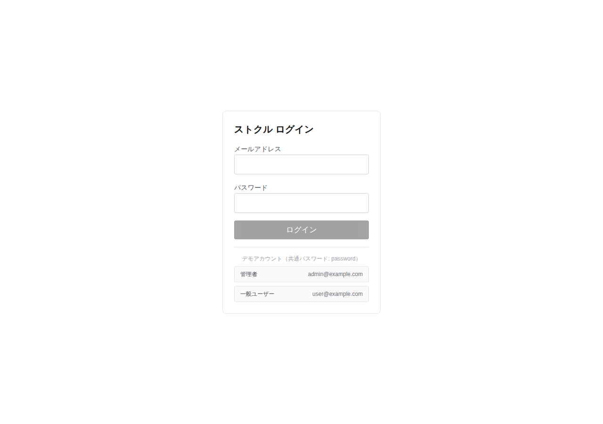
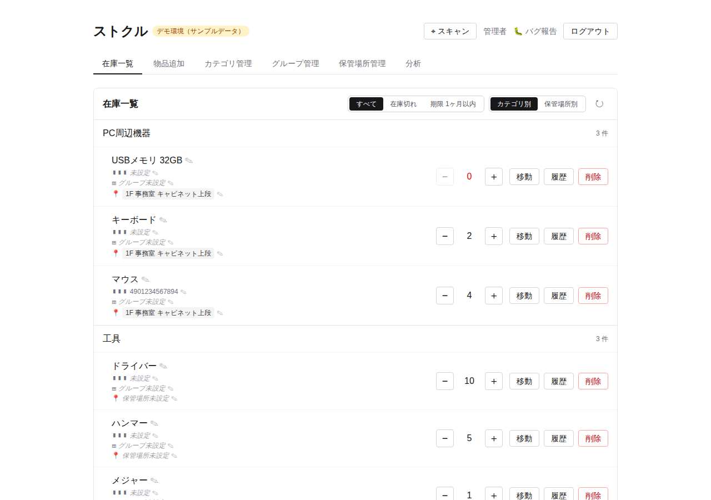
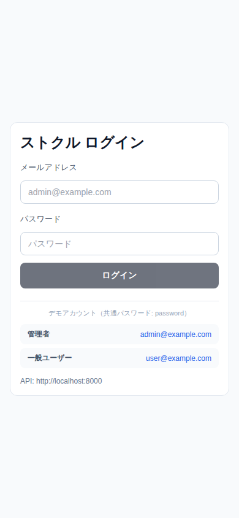
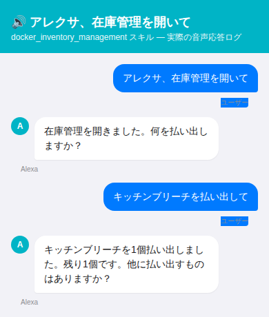

# ストクル — Stock＋Cycle（docker_inventory_management）

> **ストクル** は本システムの呼称です（旧称: 在庫管理システム）。画面上のアプリ名と Alexa スキルの呼び出し名は「ストクル」です。
> リポジトリ名・パッケージ名・Docker サービス名などの識別子は変更していません。

社内向けの簡易在庫管理アプリケーション。Laravel API + Next.js Web + Expo モバイルを Docker Compose で動かす構成。

## 機能

Web とモバイルは同じ機能を持つ (画面構成のみ各プラットフォーム向けに最適化)。

| 機能 | 内容 |
| ---- | ---- |
| 在庫一覧 | 在庫の +1 / −1、フィルタ (すべて / 在庫切れ / 期限 1ヶ月以内)、カテゴリ別 / 保管場所別の表示切り替え |
| 品目の編集 | 名前・バーコード・カテゴリ・グループ・保管場所の変更、削除、増減履歴の表示 |
| 在庫切れからの補充 | 在庫 0 からの +1 時に単価と期限を記録 (任意) |
| バーコードスキャン | 登録済みなら在庫 +1、未登録なら物品追加へ (バーコードを引き継ぐ)。Web はキーボード入力 / USB バーコードリーダー、モバイルはカメラで読み取る |
| 物品追加 | 初期在庫・単価・期限・グループ・保管場所を指定して登録 |
| マスタ管理 | カテゴリ / グループ / 保管場所の追加・削除 |
| 分析 | 在庫数・補充金額の推移 (日毎 / 月毎、総合計 / カテゴリ別) |

データはテナント単位で分離されている。デモアカウント (`admin@example.com` / `user@example.com`、パスワード `password`) からは demo テナントのサンプルデータのみ見える。

## デモ

### Web (Next.js)

| ログイン | 在庫一覧 |
| --- | --- |
|  |  |

### Mobile (Expo)



<!-- TODO: 在庫一覧・分析タブのスクリーンショットを追加 -->

### Alexa スキル

「アレクサ、ストクルを開いて」→「〇〇を払い出して」で在庫を1個払い出す音声操作。実際にスキルを呼び出したときの応答ログ (改称前の呼び出し名「在庫管理」で取得したもの):



## ディレクトリ構成

```
docker_inventory_management/
├── app/
│   ├── backend/   Laravel 12 / PHP 8.2 (REST API)
│   ├── web/       Next.js 16 / React 19 (Tailwind v4)
│   │   └── src/   app/page.tsx (画面の状態管理) / components/ / lib/ (api.ts, inventory.ts)
│   ├── mobile/    Expo 57 / React Native 0.86 (TypeScript)
│   │   └── src/   components/ / api.ts / inventory.ts / styles.ts
│   └── alexa/     Alexa カスタムスキル (Lambda ハンドラー・インタラクションモデル)
├── platform/
│   ├── docker/                  Dockerfile (php:8.2-fpm)
│   ├── docker-compose.yml       app / db / phpmyadmin / alexa-server / web
│   ├── docker-compose.prod.yml  本番構成 (Caddy リバースプロキシ)
│   ├── proxy/                   Caddyfile
│   ├── alexa-server/            方式 B 用 Express サーバー
│   ├── mysql/                   MySQL データ (gitignore)
│   └── .env.example             Docker 用環境変数の雛形
└── doc/
    ├── design.md              システム設計・API 仕様・残課題
    ├── operation.md           起動・運用手順
    ├── alexa-setup.md         Alexa スキル セットアップ手順
    ├── screenshots/           README 用スクリーンショット
    └── archive/               旧 React Native 実装の参考保管
```

Web とモバイルの表示ロジック (一覧フィルタ・セクション分け・物品追加の入力変換・グラフ目盛りなど) は `app/web/src/lib/inventory.ts` と `app/mobile/src/inventory.ts` に集約しており、**両ファイルは同一内容を保つ**。API クライアント (`api.ts`) も認証トークンの保持方法 (Web: localStorage / モバイル: メモリ) 以外は共通。仕様を変えるときは両方に反映すること。

## クイックスタート

```bash
# 1. 環境変数を準備
cp app/backend/.env.example app/backend/.env
cp platform/.env.example platform/.env       # DB パスワード / WEB_MODE 等を必要に応じて編集

# 2. 全サービス起動 (API + Web + DB + phpMyAdmin)
#    初回は MIGRATE_MODE=fresh で seed 投入
cd platform
MIGRATE_MODE=fresh docker compose up -d

# 3. APP_KEY 生成 (空のまま起動した場合)
docker compose exec app php artisan key:generate

# 4. 動作確認
open http://localhost:3000                   # Web UI (デモアカウントでログイン)
curl http://localhost:8000/up                # API ヘルスチェック (認証不要)
open http://localhost:8080                   # phpMyAdmin
```

`/api/login` 以外の API はトークン (Bearer) 認証が必要:

```bash
TOKEN=$(curl -s -X POST http://localhost:8000/api/login \
  -H 'Content-Type: application/json' -H 'Accept: application/json' \
  -d '{"email":"admin@example.com","password":"password"}' | jq -r .token)
curl -H "Authorization: Bearer $TOKEN" -H 'Accept: application/json' http://localhost:8000/api/items
```

| Service       | URL                       |
| ------------- | ------------------------- |
| Web (Next.js) | http://localhost:3000     |
| Laravel API   | http://localhost:8000     |
| phpMyAdmin    | http://localhost:8080     |
| MySQL         | localhost:3306            |

Web は既定で **production モード** (`next build` + `next start`) で起動する。開発中に HMR が欲しい場合は `WEB_MODE=dev` を指定:

```bash
WEB_MODE=dev docker compose up -d web        # その場で dev に切替
# もしくは platform/.env に WEB_MODE=dev を書いて永続化
```

詳細 (モード切替・Docker を介さない直接起動・トラブルシュート) は [doc/operation.md](doc/operation.md) を参照。

## フロントエンド

### Mobile (Expo)

モバイルは Docker に含めず、開発機から起動する:

```bash
cd app/mobile
cp .env.example .env        # EXPO_PUBLIC_API_BASE_URL を接続先 API に合わせて編集
npm install
npx expo start
```

ログイン状態はメモリ保持のため、アプリを再起動すると再ログインが必要。

> Next.js 16 / Expo 57 は破壊的変更を含むため、それぞれ `app/web/AGENTS.md` / `app/mobile/AGENTS.md` の指示に従いバージョン別ドキュメントを参照すること。

### Alexa スキル

「アレクサ、ストクルを開いて」→「○○を払い出して」で在庫を 1 個払い出すカスタムスキル。バックエンドは 2 方式から選択できる:

| 方式 | バックエンド | 概要 |
| ---- | ------------ | ---- |
| A: Lambda | AWS Lambda (Node.js 22.x) | `app/alexa/skill.zip` を Lambda にアップロード |
| B: 自サーバー | `alexa-server` コンテナ (Express) | `docker compose up -d alexa-server` で起動 |

- スキルは環境変数 `API_TOKEN` のトークンで API を呼ぶ。**操作対象はそのトークンを持つユーザーのテナントの品目**になるため、実運用データを操作するなら main テナントのユーザーでトークンを発行する。
- 品名は `app/alexa/interaction-model/ja-JP.json` のスロット型 `ITEM_NAME` で認識する。登録値にない品名も受け付けるが、実際の品目名を登録しておくと認識精度が上がる。
- 品名は完全一致を優先し、見つからなければ部分一致で探す。短い品名は別の品目に一致することがある (例: 「マウス」→「マウスウォッシュ」)。

詳細なセットアップ手順は [doc/alexa-setup.md](doc/alexa-setup.md) を参照。

## ドキュメント

- **[doc/design.md](doc/design.md)** — システム構成・データモデル・API 仕様・残課題
- **[doc/operation.md](doc/operation.md)** — 詳細な起動手順・運用 Tips・トラブルシュート
- **[doc/alexa-setup.md](doc/alexa-setup.md)** — Alexa スキル セットアップ手順 (Lambda / 自サーバー)

## セキュリティに関する注意

- `platform/docker-compose.yml` および `platform/.env.example` に記載の DB パスワードは **開発専用のデフォルト値** です。本番環境では必ず差し替えてください。
- API は `/api/login` 以外すべてトークン (Bearer) 認証必須で、データはテナント単位で分離しています。ただし認可ロール (権限差)・画面からのユーザー管理・トークンの有効期限は未実装です ([doc/design.md](doc/design.md) の残課題 T-06 参照)。
- デモアカウントのパスワードは公開前提の値です。実運用のユーザーには使わないでください。
- CORS は `app/backend/config/cors.php` で `localhost` の dev サーバのみ許可しています (本番は同一オリジン構成)。

## License

[MIT](LICENSE)
